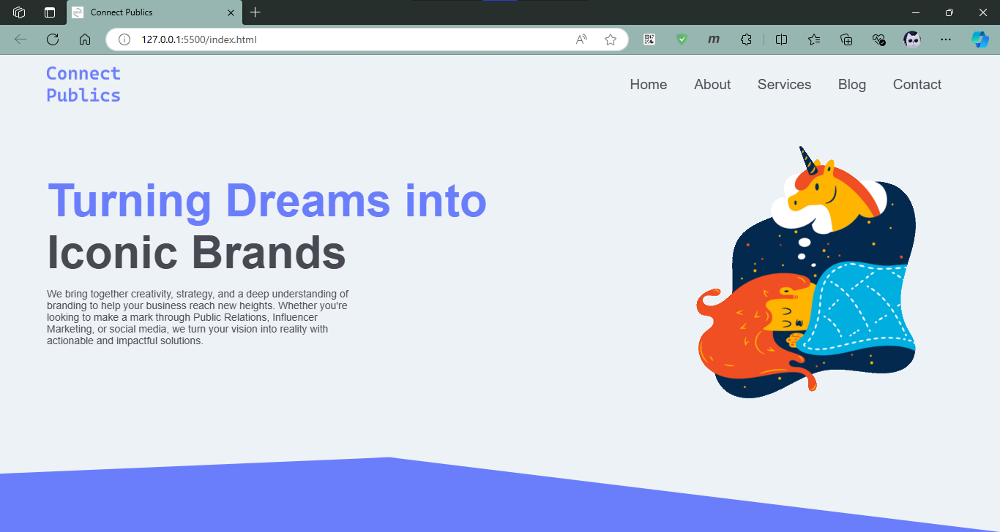

# Connect Publics

This project is a simple web page layout created with HTML and CSS. The key features include a navigation bar and a hero section.

## Features

- **Navigation Bar**: A navbar design
- **Hero Section**: A visually appealing hero section that serves as the first thing users see when visiting the page.

## Technologies Used

- **HTML5**: Markup for structuring the webpage.
- **CSS3**: Styling the elements with modern layout techniques.

## Preview

